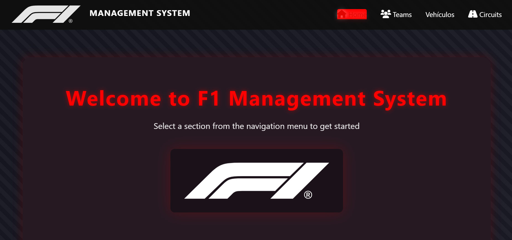

# Simulación de Fórmula 1 con Web Components y JavaScript

## Descripción

Este proyecto presenta una experiencia interactiva de la Formula 1, ofreciendo al usuario la posibilidad de diseñar y gestionar sus propias competiciones mediante la administración de circuitos, pilotos y vehículos.

La plataforma presenta las secciones de administrador y usuario, a las cuales se accede por medio de un Login. El administrador tiene la capacidad de Agregar, editar y eliminar información de equipos, vehículos y circuitos, mientras que el usuario tiene la capacidad de seleccionarlos y simular una carrera de F1.

## Características

- **Interfaz Interactiva y Modular**:  
  La plataforma utiliza Web Components para ofrecer una interfaz escalable que facilita la reutilización de código y la integración de nuevas funcionalidades.

- **Simulación en Tiempo Real**:  
  Disfruta de animaciones dinámicas en vehículos con presentaciones 3D, proporcionando una experiencia visual atractiva y realista.

- **Gestión Completa de Entidades**:  
  Administra circuitos, pilotos y vehículos con funcionalidades CRUD que permiten agregar, editar, eliminar y buscar cada elemento de manera sencilla y eficiente.

- **Personalización Avanzada**:  
  Configura condiciones climáticas, reglajes de vehículos y estrategias de equipo para crear escenarios de carrera únicos y personalizados.

- **Persistencia de Datos**:  
  Guarda la información mediante integrando JSON Server, asegurando que las configuraciones y progresos se mantengan a lo largo del tiempo.

- **Diseño Responsivo**:  
  Uso de Bootstrap, por el cual, la aplicación se adapta perfectamente a dispositivos móviles y de escritorio, ofreciendo una experiencia óptima en cualquier pantalla.

## Technologies Used

- HTML5
- CSS3
- JavaScript

## Recursos:

Calidad en imagenes y videos optimizados 

## Diseño: 

- Login

- Admin

- User

